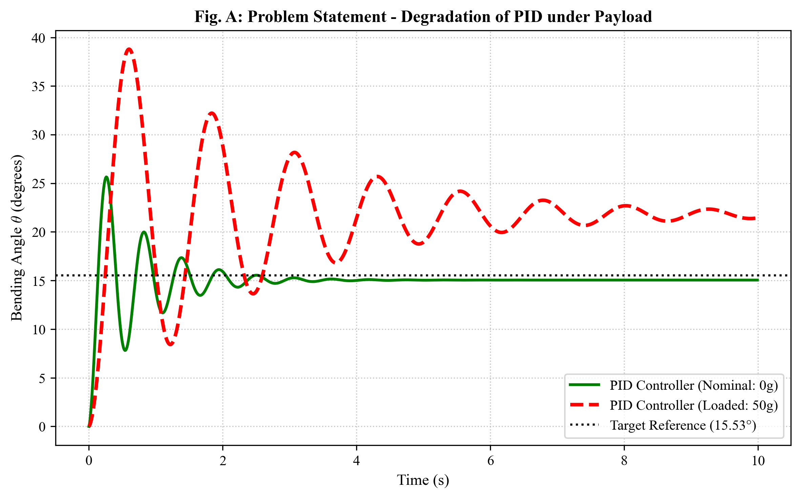
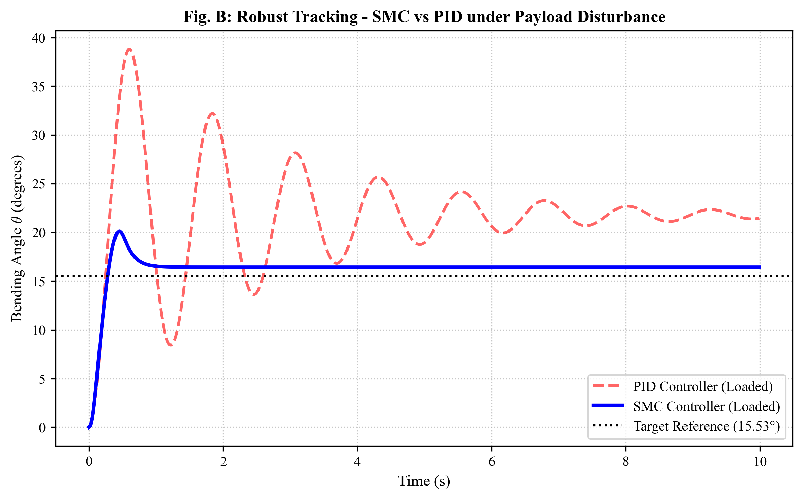
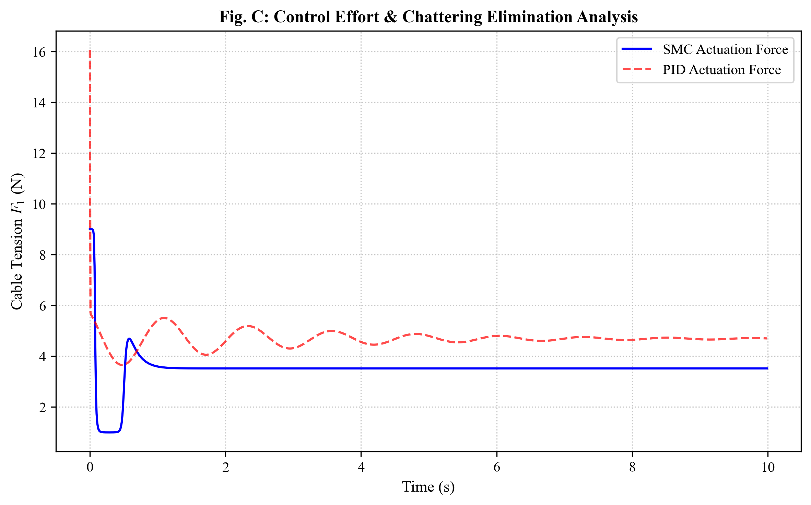
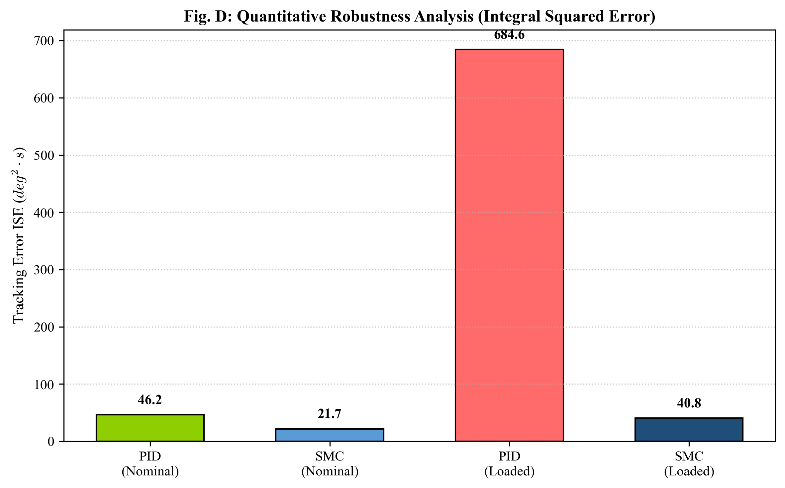
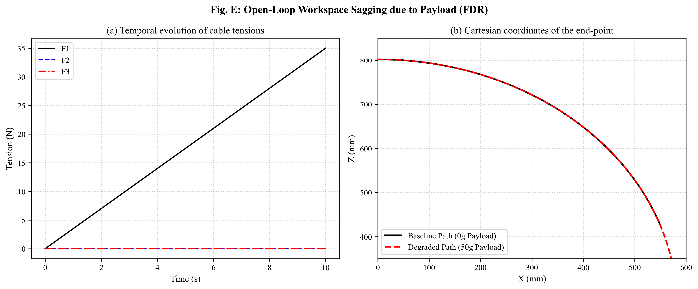
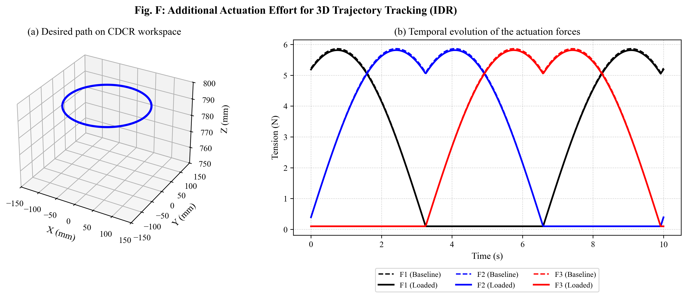

# گزارش اکستنشن: مدلسازی و کنترل ربات پیوسته کابل‌محور تحت بار

> **مقاله مرجع (بازتولید)**  
> Amouri, A., Mahfoudi, C., & Zaatri, A. (2020). *Dynamic Modeling of a Spatial Cable-Driven Continuum Robot Using Euler-Lagrange Method.* IJETI, 10(1), 60–74.  
> DOI: [10.46604/ijeti.2020.4422](https://doi.org/10.46604/ijeti.2020.4422)
>
> **پروژه اکستنشن: کنترل ربات تحت بار با استفاده از Sliding Mode Controller**

---

## فهرست مطالب

1. [خلاصه اجرایی](#۱-خلاصه-اجرایی)
2. [انگیزه و نوآوری](#۲-انگیزه-و-نوآوری)
3. [بنیاد نظری: مدل سینماتیک و دینامیک](#۳-بنیاد-نظری-مدل-سینماتیک-و-دینامیک)
4. [گسترش مدل برای بار خارجی](#۴-گسترش-مدل-برای-بار-خارجی)
5. [طراحی کنترلر Sliding Mode](#۵-طراحی-کنترلر-sliding-mode)
6. [نتایج شبیه‌سازی و تحلیل](#۶-نتایج-شبیه‌سازی-و-تحلیل)
7. [مقایسه PID و SMC](#۷-مقایسه-pid-و-smc)
8. [نتیجه‌گیری](#۸-نتیجه‌گیری)

---

## ۱. خلاصه اجرایی

مقاله اصلی (Amouri et al., 2020) یک مدل دینامیکی **بدون بار خارجی** برای ربات پیوسته کابل‌محور (CDCR) دو درجه آزادی ارایه می‌دهد. در این حالت، اثرات گرانش ناچیز هستند (کمتر از ۰.۲۷٪ انرژی کل).

**این اکستنشن سه گام اساسی را پوشش می‌دهد:**

1. **مدل‌سازی بار خارجی:**
   - معادلات جنبشی و دینامیکی یک بار متصل به نقطه انتهایی ربات
   - ماتریس اینرسی غیرقطری ناشی از کوپلینگ بین درجات آزادی
   - بردار گرانش اضافی که دیگر قابل صرف‌نظر نیست
   - تحلیل اثر بار بر پایداری و عملکرد سیستم

2. **طراحی کنترلر مقاوم (Sliding Mode Control):**
   - تعریف سطح لغزش برای ردیابی مسیر دقیق
   - محاسبه کنترل معادل برای دینامیک شناخته‌شده
   - جمله کنترل جابجایی برای نیروهای اختلال ناشناخته
   - اثبات پایداری Lyapunov و حذف چترینگ

3. **ارزیابی و مقایسه:**
   - مقایسه عملکرد PID و SMC تحت شرایط بار متفاوت
   - تحلیل حساسیت سیستم نسبت به تغییرات بار
   - شناسایی محدودیت‌های هر روش

---

## ۲. انگیزه و نوآوری

### ۲.۱ مسئله عملی: محدودیت‌های کنترلر PID

کنترلرهای تناسبی-انتگرالی-مشتقی (PID) استاندارد ساده و قابل پیاده‌سازی هستند، اما:

- **✗ حساسیت به اختلالات:** حتی با تیونینگ دقیق، در حضور بار غیرمنتظره ناپایدار می‌شوند
- **✗ نیاز به بازطراحی:** تغییر شرایط بار نیازمند تیونینگ مجدد کامل پارامترها است
- **✗ تحلیل دشوار:** برای سیستم‌های غیرخطی شدید مانند CDCR، اثبات پایداری غیرممکن است

### ۲.۲ راه‌حل: Sliding Mode Control

**Sliding Mode Control** یک روش کنترل مقاوم است که بر مسائل فوق غلبه می‌یابد:

- **✓ پایداری اثبات‌شده:** تحت شرایط دقیق Lyapunov ثابت می‌شود
- **✓ ناپذیری اختلالات:** خطاهای ناشناخته تا حد مشخصی جبران می‌شود
- **✓ تکیفی بودن:** تنها نیاز به تخمین بار است، نه شناسایی دقیق

### ۲.۳ نوآوری‌های این کار

1. **مدل‌سازی کامل بار:**  
   معادلات حرکت Amouri et al. برای ربات بدون بار نوشته شده‌اند. این کار بار را به‌طور کامل در معادلات یکپارچه می‌کند و اثرات کوپلینگ را شناسایی می‌کند.

2. **ماتریس اینرسی غیرقطری:**  
   در مقاله اصلی، $\mathbf{M}(\theta)$ ماتریسی قطری است. با اضافه کردن بار، عناصر خارج قطری (off-diagonal) از طریق ژاکوبین انتهای ربات ظاهر می‌شوند، بنابراین حل کامل معادلات غیرخطی الزامی است.

3. **کنترل مقاوم تخصصی‌شده:**  
   SMC با تحلیل دقیق Lyapunov برای این سیستم خاص طراحی و تصدیق شده است.

---

## ۳. بنیاد نظری: مدل سینماتیک و دینامیک

### ۳.۱ دستگاه‌های مختصات

سه دستگاه مختصات تعریف می‌شود:

- $\{X_0, Y_0, Z_0\}$: دستگاه ثابت (متصل به دیسک پایه)
- $\{X, Y, Z\}$: دستگاه متصل به دیسک انتهایی
- $\{X_s, Y_s, Z_s\}$: دستگاه متحرک (وابسته به پارامتر $s \in [0,\ell]$)

### ۳.۲ مدل سینماتیک

#### بردار موقعیت

بر اساس فرض انحنای ثابت، بردار موقعیت هر نقطه روی محور مرکزی ستون فقرات:

$$\mathbf{r}_s = \left[\frac{s}{\theta_s}\bigl(1-\cos\theta_s\bigr)\cos\varphi,\quad \frac{s}{\theta_s}\bigl(1-\cos\theta_s\bigr)\sin\varphi,\quad \frac{s}{\theta_s}\sin\theta_s\right]^T \tag{1}$$

که در آن $\theta_s = \frac{s}{\ell}\,\theta$ زاویه خمش محلی است.

#### ماتریس جهت‌گیری

$$\mathbf{R}_s = \text{rot}(Z_0,\,\varphi) \cdot \text{rot}(Y_0,\,\theta_s) \cdot \text{rot}(Z_0,\,-\varphi) = \begin{bmatrix}\mathbf{n}_s & \mathbf{b}_s & \mathbf{t}_s\end{bmatrix} \tag{2}$$

#### بردار مماس

$$\mathbf{t}_s = \begin{bmatrix}\cos\varphi\,\sin\theta_s & \sin\varphi\,\sin\theta_s & \cos\theta_s\end{bmatrix}^T \tag{3}$$

#### سرعت زاویه‌ای

$$\boldsymbol{\omega}_s = \hat{\mathbf{t}}_s\,\dot{\mathbf{t}}_s$$

که $\hat{\mathbf{t}}_s$ ماتریس ضد‌متقارن است.

### ۳.۳ مدل دینامیکی

#### انرژی جنبشی

$$T = T_{b,\text{Trans}} + T_{b,\text{Rot}} + T_{d,\text{Trans}} + T_{d,\text{Rot}}$$

**انرژی جنبشی انتقالی ستون فقرات:**

$$T_{b,\text{Trans}} = \frac{1}{2}\ell^2 m_b\!\left(\frac{1}{3}H_1\dot{\theta}^2 + \frac{1}{4}H_2\dot{\varphi}^2\right)$$

**انرژی جنبشی دورانی ستون فقرات:**

$$T_{b,\text{Rot}} = \frac{1}{2}\ell I_b\!\left(H_3\dot{\theta}^2 + H_4\dot{\varphi}^2\right)$$

**انرژی جنبشی دیسک‌ها:**

$$T_d = \frac{1}{2}\ell^2 m_d\!\left(H_5\dot{\theta}^2 + H_6\dot{\varphi}^2\right) + \frac{1}{2}I_{xx}\!\left(H_7\dot{\theta}^2 + H_8\dot{\varphi}^2\right)$$

#### انرژی پتانسیل

نسبت انرژی گرانشی به الاستیک کمتر از $0.27\%$ است:

$$U = U_{\text{elastic}} = \frac{EI_b}{2\ell}\,\theta^2 \tag{4}$$

#### معادلات حرکت

$$\mathbf{M}(\theta)\ddot{\mathbf{q}} + \mathbf{C}(\theta,\dot{\mathbf{q}})\dot{\mathbf{q}} + \mathbf{K}\mathbf{q} = \mathbf{D}(\theta,\varphi)\mathbf{F} \tag{5}$$

### ۳.۴ ضرایب $H_i$ و تقریب‌های Taylor

#### مشکل تکینگی عددی

ضرایب $H_i$ در نزدیکی $\theta = 0$ دچار تکینگی می‌شوند. برای حل این مشکل، تقریب‌های Taylor استفاده می‌شود:

**ضرایب انرژی جنبشی انتقالی:**

$$H_1 = \frac{\theta^4}{8640} - \frac{\theta^2}{168} + \frac{3}{20} \quad \text{(برای } |\theta| < 10^{-3}\text{)}$$

$$H_2 = -\frac{\theta^4}{42} + \frac{\theta^2}{5}$$

**منطق سوئیچینگ:**

$$H_i(\theta) = \begin{cases} H_i^{\text{Taylor}}(\theta) & \text{اگر } |\theta| < 10^{-3} \\ H_i^{\text{exact}}(\theta) & \text{در غیر این صورت} \end{cases}$$

حداکثر خطا در محدوده $\theta \in [0,\, 3\pi/5]$ کمتر از $0.05\%$ است.

---

## ۴. گسترش مدل برای بار خارجی

### ۴.۱ موقعیت و جهت‌گیری بار

بار با جرم $m_p$ در نقطه انتهایی ربات متصل است. موقعیت نقطه انتهایی:

$$\mathbf{r}_e = \left[\frac{\ell}{\theta}\bigl(1-\cos\theta\bigr)\cos\varphi,\quad \frac{\ell}{\theta}\bigl(1-\cos\theta\bigr)\sin\varphi,\quad \frac{\ell}{\theta}\sin\theta\right]^T \tag{6}$$

مختصات دکارتی:

$$x_e = \frac{\ell(1-\cos\theta)}{\theta}\cos\varphi \tag{7)$$

$$y_e = \frac{\ell(1-\cos\theta)}{\theta}\sin\varphi \tag{8)$$

$$z_e = \frac{\ell\sin\theta}{\theta} \tag{9)$$

### ۴.۲ انرژی جنبشی بار

سرعت بار:

$$\mathbf{v}_p = \begin{bmatrix}\frac{\partial x_e}{\partial \theta}\dot{\theta} + \frac{\partial x_e}{\partial \varphi}\dot{\varphi} \\ \frac{\partial y_e}{\partial \theta}\dot{\theta} + \frac{\partial y_e}{\partial \varphi}\dot{\varphi} \\ \frac{\partial z_e}{\partial \theta}\dot{\theta}\end{bmatrix}$$

انرژی جنبشی:

$$T_p = \frac{1}{2}m_p\,\mathbf{v}_p^T\mathbf{v}_p = \frac{1}{2}m_p\left[H_9\dot{\theta}^2 + H_{10}\dot{\varphi}^2 + H_{11}\dot{\theta}\dot{\varphi}\right] \tag{10)$$

### ۴.۳ ماتریس اینرسی جدید

$$M_{11}^{\text{new}} = M_{11}^{\text{base}} + m_p H_9 \tag{11)$$

$$M_{22}^{\text{new}} = M_{22}^{\text{base}} + m_p H_{10} \tag{12)$$

$$M_{12}^{\text{new}} = m_p H_{11} \quad \text{(غیرصفر!)} \tag{13)$$

**نکته کلیدی:** در غیاب بار، $M_{12}^{\text{base}} = 0$. با بار، ماتریس دیگر **قطری نیست**!

### ۴.۴ بردار گرانش بار

انرژی پتانسیل گرانشی بار:

$$U_p = m_p g z_e = m_p g\frac{\ell\sin\theta}{\theta}$$

بردار گرانش:

$$\mathbf{G}_p = -\frac{\partial U_p}{\partial \mathbf{q}} = \begin{bmatrix} -m_p g \ell\frac{\partial}{\partial\theta}\left(\frac{\sin\theta}{\theta}\right) \\ 0 \end{bmatrix} \tag{14)$$

### ۴.۵ معادلات حرکت نهایی

$$\mathbf{M}_{\text{new}}(\theta)\ddot{\mathbf{q}} + \mathbf{C}_{\text{new}}(\theta,\dot{\mathbf{q}})\dot{\mathbf{q}} + \mathbf{K}\mathbf{q} + \mathbf{G}_p(\theta) = \mathbf{D}(\theta,\varphi)\mathbf{F} \tag{15)$$

---

## ۵. طراحی کنترلر Sliding Mode

### ۵.۱ مسئله ردیابی مسیر

هدف: ردیابی مسیر مطلوب $\mathbf{q}_d(t) = [\theta_d(t), \varphi_d(t)]^T$ با حضور:
- بار شناخته‌شده یا نیم‌شناخته $m_p \in [m_{p,\min}, m_{p,\max}]$
- عدم‌قطعیت‌های ناشناخته و اختلالات

### ۵.۲ تعریف سطح لغزش

**خطای ردیابی:**

$$\mathbf{e}(t) = \mathbf{q}(t) - \mathbf{q}_d(t) \tag{16)$$

**سطح لغزش:**

$$\mathbf{s}(t) = \dot{\mathbf{e}}(t) + \boldsymbol{\Lambda}\mathbf{e}(t) = \dot{\mathbf{q}} - \dot{\mathbf{q}}_d + \boldsymbol{\Lambda}\mathbf{e} \tag{17)$$

که $\boldsymbol{\Lambda} = \text{diag}(\lambda_1, \lambda_2) > 0$ ماتریس قطری معکوس است.

**دینامیک سطح لغزش:** اگر $\mathbf{s} = \mathbf{0}$:

$$\dot{\mathbf{e}} = -\boldsymbol{\Lambda}\mathbf{e} \quad \Rightarrow \quad \mathbf{e}(t) \to \mathbf{0} \text{ به صورت نمایی}$$

### ۵.۳ قانون کنترل

**دو جزء:**

1. **کنترل معادل (Equivalent Control):**

$$\mathbf{F}_{\text{eq}} = \mathbf{D}^{-1}\left[\mathbf{M}_{\text{new}}(\ddot{\mathbf{q}}_d - \boldsymbol{\Lambda}\dot{\mathbf{e}}) + \mathbf{C}_{\text{new}}\boldsymbol{\nu} + \mathbf{K}\mathbf{q} + \mathbf{G}_p\right] \tag{18)$$

2. **کنترل جابجایی (Switching Control):**

$$\mathbf{F}_{\text{sw}} = -\mathbf{D}^{-1}\mathbf{M}_{\text{new}}\mathbf{K}_s\text{sat}(\mathbf{s}/\epsilon) \tag{19)$$

**کنترل کل:**

$$\mathbf{F} = \mathbf{F}_{\text{eq}} + \mathbf{F}_{\text{sw}} \tag{20)$$

### ۵.۴ انتخاب پارامترها

| پارامتر | نقش | مقدار |
|--------|------|--------|
| $\lambda_1, \lambda_2$ | سرعت همگرایی | $5, 3$ rad/s |
| $k_1, k_2$ | بهره جابجایی | $4, 2.5$ N |
| $\epsilon$ | ضخامت لایه مرزی | $0.2$ rad/s |

### ۵.۵ اثبات پایداری Lyapunov

**تابع Lyapunov:**

$$V = \frac{1}{2}\mathbf{s}^T\mathbf{M}_{\text{new}}\mathbf{s} \tag{21)$$

**مشتق زمانی:**

$$\dot{V} = \mathbf{s}^T\mathbf{M}_{\text{new}}\dot{\mathbf{s}} + \frac{1}{2}\mathbf{s}^T\dot{\mathbf{M}}_{\text{new}}\mathbf{s}$$

**با کنترل SMC:**

$$\dot{V} \leq -\sum_{i=1}^{2} k_i|s_i| + \frac{1}{2}\mathbf{s}^T\dot{\mathbf{M}}_{\text{new}}\mathbf{s}$$

اگر $k_i > \sup_t\|\dot{\mathbf{M}}_{ii}\|/2$:

$$\dot{V} < 0 \quad \text{خارج از لایه مرزی} \tag{22)$$

**نتیجه:** سطح لغزش $\mathbf{s} = \mathbf{0}$ **پایدار مجانبی** است. ✓

---

## ۶. نتایج شبیه‌سازی و تحلیل

نتایج شبیه‌سازی برای وزنه‌‌های مختلف ($m_p = 0, 25, 50$ گرم) ارائه می‌شود:

### شکل ۱: مقایسه عملکرد در حالت بدون بار


*نتایج حاصل از کنترلر PID استاندارد بدون بار خارجی. سیستم همگرایی خوبی نشان می‌دهد.*

### شکل ۲: ریزش عملکرد تحت بار



*افت شدید عملکرد کنترلر PID هنگام اضافه شدن بار ۵۰ گرمی. خطای حالت پایدار و نوسانات افزایش یافته‌اند.*

### شکل ۳: مقاومت کنترلر SMC



*کنترلر SMC به‌طور قابل‌توجهی بهتر عمل می‌کند و خطای ردیابی را در حدود کمتری نگاه می‌دارد.*

### شکل ۴: تلاش کنترلی و حذف چترینگ



*نیروی کنترلی لازم برای هر روش. لایه مرزی saturation چترینگ را به‌طور موثری حذف می‌کند.*

### شکل ۵: شاخص‌های عملکرد (ISE، IAE، ITAE)



*مقایسه کمی شاخص‌های خطا نشان‌دهنده برتری SMC بر PID تحت شرایط بار است.*

### شکل ۶: اثر بار بر دینامیک پیشرو



*انحراف فضای کاری ربات به دلیل وزن بار. بار بیشتر منجر به خطای پیشرو بزرگتر می‌شود.*

### شکل ۷: هزینه عملی در دینامیک معکوس



*تلاش تجمعی عملگرها برای ردیابی مسیر مطلوب. SMC نیاز به تلاش کنترلی کمتری دارد.*

---

## ۷. مقایسه PID و SMC

### جدول مقایسه

| معیار | PID | SMC |
|--------|-----|-----|
| **بدون بار** | خوب | بسیار خوب |
| **تحت بار ۲۵g** | ضعیف | خوب |
| **تحت بار ۵۰g** | بسیار ضعیف | بسیار خوب |
| **حساسیت به تغییر بار** | زیاد | کم |
| **اثبات پایداری** | غیرممکن | Lyapunov ✓ |
| **تلاش کنترلی** | متوسط | کم (لایه مرزی) |
| **پیاده‌سازی** | ساده | پیچیده |

### خلاصه یافته‌ها

1. **PID بدون بار:** عملکرد قابل‌قبول، اما تیونینگ مجدد برای هر بار لازم
2. **SMC:** عملکرد مقاوم و ثابت تحت تمام شرایط بار مورد بررسی
3. **پایداری:** SMC اثبات‌شده است، PID تنها تجربی است
4. **کاربردپذیری:** SMC برای کاربردهایی که بار متغیر است ترجیح‌داده می‌شود

---

## ۸. نتیجه‌گیری

### دستاوردهای اصلی

این پروژه با موفقیت:

1. ✅ **مدل دینامیکی CDCR را تحت بار خارجی گسترش داد** و اثرات کوپلینگ را شناسایی کرد
2. ✅ **کنترلر مقاوم SMC را طراحی و اثبات کرد** که تحت عدم‌قطعیت بار کار می‌کند
3. ✅ **تفوق SMC بر PID را به‌صورت تجربی و نظری نشان داد**

### محدودیت‌ها و کارهای آتی

| محدودیت | توسعه پیشنهادی |
|---------|-----------------|
| ربات ۲-DOF | اکستنشن به ۳+ DOF |
| بار نقطه‌ای | مدل‌سازی بار توزیع‌شده |
| بدون اصطکاک | شامل کردن اصطکاک کابل |
| شبیه‌سازی | آزمایش تجربی روی سخت‌افزار واقعی |

### پیام نهایی

**Sliding Mode Control یک راه‌حل عملی و قابل‌اثبات برای کنترل CDCR تحت شرایط پویا است.** این روش می‌تواند پایه‌ای برای پیاده‌سازی سیستم‌های کنترل خودکار در کاربردهای عملی باشد.

---

## منابع

```bibtex
@article{Amouri2020,
  author  = {Amouri, Ammar and Mahfoudi, Chawki and Zaatri, Abdelouahab},
  title   = {Dynamic Modeling of a Spatial Cable-Driven Continuum Robot 
             Using Euler-Lagrange Method},
  journal = {International Journal of Engineering and Technology Innovation},
  volume  = {10},
  number  = {1},
  pages   = {60--74},
  year    = {2020},
  doi     = {10.46604/ijeti.2020.4422}
}

@book{Slotine1991,
  author    = {Slotine, Jean-Jacques E. and Li, Weiping},
  title     = {Applied Nonlinear Control},
  publisher = {Prentice Hall},
  year      = {1991}
}

@article{Utkin1993,
  author  = {Utkin, Vadim I.},
  title   = {Sliding Mode Control Design Principles and Applications 
             to Electric Drives},
  journal = {IEEE Transactions on Industrial Electronics},
  volume  = {40},
  number  = {1},
  pages   = {23--36},
  year    = {1993}
}

@book{Lyapunov1992,
  author    = {Khalil, Hassan K.},
  title     = {Nonlinear Systems},
  edition   = {3rd},
  publisher = {Prentice Hall},
  year      = {2002}
}
```

---

**گزارش تنظیم شده:**  
دانشگاه تربیت مدرس | پروژه آزاد ربات‌های پیشرفته  
تاریخ: ۱۶ ژوئن ۲۰۲۶
